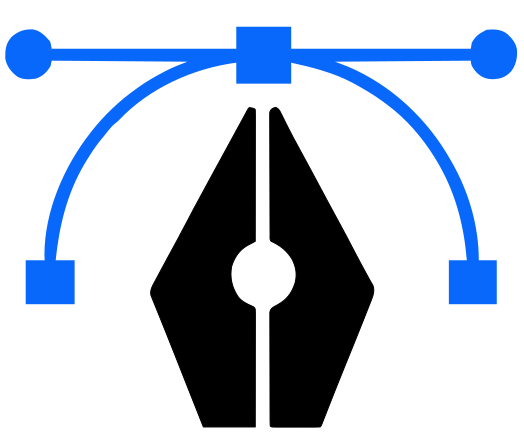

<div align="center">



# PathSmith

**A fast, self-hostable image toolkit in Rust — two tools, one core.**

Turn rasters into clean SVGs, and slice one image into many crops in a single pass.
Runs as a web app, an HTTP API, a CLI, a Docker container, a WASM module, or a Rust library.


</div>

---

## Contents

- [The two tools](#the-two-tools)
- [Surfaces at a glance](#surfaces-at-a-glance)
- [Quick start](#quick-start)
- [Web app](#web-app)
- [HTTP API](#http-api)
- [CLI](#cli)
- [Docker](#docker)
- [WASM / npm (in-browser)](#wasm--npm-in-browser)
- [Rust library](#rust-library)
- [Presets](#presets)
- [Build from source](#build-from-source)
- [Notes vs. the Python reference](#notes-vs-the-python-reference)
- [Roadmap](#roadmap)
- [License](#license)

---

## The two tools

| | Tool | What it does |
|---|---|---|
| 🖼️ → 📐 | **Vectorize** | Raster → SVG with multiple tracing pipelines ("variants"). Generate one, or generate several and compare side by side. Pipeline: **preprocess → trace ([vtracer](https://crates.io/crates/vtracer)) → postprocess**. |
| ✂️ | **Multicrop** | Upload one image, mark multiple bounding boxes, and get one PNG crop per box in a single pass. Boxes that overhang the edge are trimmed, not rejected. |

**Why PathSmith**

- ⚡ **Fast** — pure-Rust, in-memory pipeline; conversions and crops run in parallel.
- 🔒 **Self-hostable & offline** — one ~44 MB container, no external services, your images never leave your machine.
- 🧩 **One core, many surfaces** — the same [`pathsmith-core`](crates/core) crate powers the CLI, server, browser (WASM), and any Rust app.
- 🆓 **Open source** — AGPL-3.0 (commercial license available).

---

## Surfaces at a glance

| Surface | Crate | Best for | Vectorize | Multicrop |
|---|---|---|:---:|:---:|
| [Web app](#web-app) | `pathsmith-server` | point-and-click, drawing crop boxes | ✅ | ✅ |
| [HTTP API](#http-api) | `pathsmith-server` | scripting, integrating into other apps | ✅ | ✅ |
| [CLI](#cli) | `pathsmith-cli` | local/batch/CI, benchmarking | ✅ | — |
| [Docker](#docker) | `pathsmith-server` | self-hosting the web app + API | ✅ | ✅ |
| [WASM / npm](#wasm--npm-in-browser) | `pathsmith-wasm` | fully client-side, no upload | ✅ | — |
| [Rust library](#rust-library) | `pathsmith-core` | embedding in your own Rust code | ✅ | ✅ |

> [!NOTE]
> Multicrop is served by the HTTP API and the library. The CLI and WASM build currently cover Vectorize only.

---

## Quick start

The fastest way to get the web app **and** the API is Docker:

```bash
docker build -t pathsmith .
docker run -p 8080:8080 pathsmith
# open http://localhost:8080
```

Or run it straight from source (builds core + CLI + server):

```bash
cargo run --release -p pathsmith-server   # http://0.0.0.0:8080, UI at /
```

> [!TIP]
> Everything runs locally. Set `PATHSMITH_UI=0` (or pass `--no-ui`) to run a headless, API-only server.

---

## Web app

`pathsmith-server` embeds a single-page UI (bundled into the binary at build time via `rust-embed` — no separate web build step). It has two tabs:

- **Vectorize** — drop an image, tick one or more variants, hit **Generate**. Each result is previewed on a checkerboard, can be opened in a zoom/pan inspector, and downloaded individually or all together as a `.zip`.
- **Multicrop** — drop an image, **drag rectangles** on it to mark crops, optionally name each box, then **Generate crops**. Download each PNG, or all of them as a `.zip`.

```bash
cargo run --release -p pathsmith-server            # UI + API at http://0.0.0.0:8080
cargo run --release -p pathsmith-server -- --no-ui # API only (or PATHSMITH_UI=0)
```

**Configuration** (flag / env var):

| Flag | Env | Default | Purpose |
|---|---|---|---|
| `--port` | `PORT` | `8080` | Port to listen on |
| `--host` | `PATHSMITH_HOST` | `0.0.0.0` | Interface to bind |
| `--no-ui` | `PATHSMITH_UI=0` | UI on | Disable the bundled web UI (pure API) |
| `--max-bytes` | `PATHSMITH_MAX_BYTES` | `20 MiB` | Max upload size |
| `--max-concurrency` | `PATHSMITH_MAX_CONCURRENCY` | `64` | Max in-flight conversions |
| `--timeout-secs` | `PATHSMITH_TIMEOUT_SECS` | `60` | Per-request timeout |

---

## HTTP API

The request body is always the **raw image bytes** (`curl --data-binary @img.png`, or a browser `fetch(url, { method: 'POST', body: file })`). Accepts PNG, JPEG, WebP, GIF, and BMP.

| Method & path | Returns |
|---|---|
| `GET /healthz` | `ok` |
| `GET /presets` | `[{ name, description }, …]` |
| `POST /convert?pipeline=<name>` | `image/svg+xml` (single variant) |
| `POST /convert/batch?pipelines=all` | JSON `{ results: {name:{svg,bytes}}, errors }` |
| `POST /convert/batch?pipelines=…&zip=1` | `application/zip` of every SVG |
| `POST /crop?boxes=<json>` | JSON `{ results: {name:{png,bytes}}, errors }` (`png` is base64) |
| `POST /crop?boxes=<json>&zip=1` | `application/zip` of every PNG crop |

### Vectorize

```bash
# single variant
curl --data-binary @icons/10_hero.png \
  "http://localhost:8080/convert?pipeline=outlined" -o hero.svg

# several variants in one request
curl --data-binary @icons/10_hero.png \
  "http://localhost:8080/convert/batch?pipelines=raw,flat,outlined"

# all variants as a zip
curl --data-binary @icons/10_hero.png \
  "http://localhost:8080/convert/batch?pipelines=all&zip=1" -o variants.zip

# list variants + descriptions
curl http://localhost:8080/presets
```

### Multicrop

`boxes` is a URL-encoded JSON array of `{ x, y, width, height, label? }` in **source-image pixels**. Without a `label`, crops are named `crop-1`, `crop-2`, …

```bash
# two crops -> JSON with base64 PNGs (results keyed by label)
curl --data-binary @icons/10_hero.png \
  'http://localhost:8080/crop?boxes=[{"x":0,"y":0,"width":64,"height":64,"label":"corner"},{"x":80,"y":80,"width":120,"height":120}]'

# all crops as a zip (corner.png, crop-2.png, …)
curl --data-binary @icons/10_hero.png \
  'http://localhost:8080/crop?zip=1&boxes=[{"x":0,"y":0,"width":64,"height":64,"label":"corner"}]' -o crops.zip
```

---

## CLI

```bash
cargo build --release            # builds core, cli, server

# convert one image with a chosen variant
./target/release/pathsmith convert input.png out.svg --pipeline hybrid

# list available variants
./target/release/pathsmith presets

# benchmark every variant over input/png/ -> output/report.md (parallel;
# renders each SVG back to PNG and scores match% / MAE / SSIM)
./target/release/pathsmith bench --input input/png --out output --tolerance 5
```

---

## Docker

The image builds only `pathsmith-server`; the web UI is embedded into the binary, so the runtime stage is a tiny distroless image (~44 MB, no shell or package manager).

```bash
docker build -t pathsmith .

docker run -p 8080:8080 pathsmith                  # UI + API
docker run -p 8080:8080 -e PATHSMITH_UI=0 pathsmith # API only
```

> [!TIP]
> All the [server configuration](#web-app) env vars (`PORT`, `PATHSMITH_HOST`, `PATHSMITH_MAX_BYTES`, …) work with `docker run -e`.

---

## WASM / npm (in-browser)

Run Vectorize **fully client-side** — no upload, no server.

```bash
wasm-pack build crates/wasm --target web   # outputs the npm package to crates/wasm/pkg/
```

```js
import init, { convert, presets } from "pathsmith-wasm";
await init();
const svg = convert(new Uint8Array(await file.arrayBuffer()), "hybrid");
```

See [crates/wasm/example/](crates/wasm/example/) for a runnable demo. Conversion is CPU-bound and synchronous — run it inside a Web Worker for large images so the UI thread stays responsive.

---

## Rust library

Embed the pipeline (and multicrop) directly:

```toml
[dependencies]
pathsmith-core = { git = "https://github.com/TheAnimatrix/PathSmith" }
```

```rust
// Vectorize
let svg = pathsmith_core::convert_bytes(&png_bytes, "hybrid")?;

// Multicrop — one PNG per box
use pathsmith_core::multicrop::CropBox;
let boxes = [CropBox { x: 0, y: 0, width: 64, height: 64, label: Some("corner".into()) }];
for (name, result) in pathsmith_core::multicrop::crop_bytes(&png_bytes, &boxes)? {
    let png: Vec<u8> = result?;        // write `{name}.png`
}
```

`pathsmith-core` is pure Rust with no filesystem or platform dependencies, which is why the same crate drives every surface above.

---

## Presets

There are 14 Vectorize presets — `raw`, `raw_sealed`, `smooth`, `smooth_sealed`, `flat`, `hybrid`, `outlined`, `mono_lineart`, `clean_color`, `max_fidelity`, `passthrough`, … Run `pathsmith presets` (or `GET /presets`) for the full list with descriptions.

---

## Build from source

This is a Cargo workspace: `pathsmith-core` (library), `pathsmith-cli`, `pathsmith-server`, and `pathsmith-wasm`.

```bash
cargo build --release    # core + cli + server
cargo test               # unit tests (pipeline + multicrop)
```

`pathsmith-wasm` targets `wasm32-unknown-unknown` and is built separately with `wasm-pack` (see [WASM](#wasm--npm-in-browser)).

---

## Notes vs. the Python reference

The original Python tool is preserved under [`legacy/`](legacy/). The Rust rewrite keeps the same presets and pipeline structure but is **not** bit-identical: the Rust k-means/bilateral differ from OpenCV's, so verify quality with `pathsmith bench` (match% and MAE are computed identically; the SSIM column uses a structural-similarity metric for relative comparison). It also drops the temp-file round-trip (in-memory tracing), replaces regex SVG post-processing with a real XML pass, relies on vtracer's `path_precision` instead of post-hoc rounding, and seeds k-means for reproducibility.

---

## Roadmap

- 🔍 **Easy result comparison** — compare Vectorize outputs side by side (or with a slider / diff) so picking the best variant is quick without opening each preview separately.
- 🪄 **Remove background (PNG → SVG)** — optional background removal in the Vectorize flow so logos and icons trace cleanly without a solid or checkerboard backdrop in the SVG.
- ✏️ **SVG editor** — tweak and clean up traced output in the browser (paths, colors, nodes) before downloading, instead of re-running with a different preset.
- 🎯 **Better raster → SVG** — improve the tracing pipelines: sharper edges, fewer/cleaner paths, smaller files, and closer fidelity to the source.
- 📐 **SVG in Multicrop** — upload SVGs (not just rasters), draw crop boxes in the same UI, and export cropped regions as SVG (or raster) so vector assets can be batched without rasterizing first.
- 🤖 **Auto-detect crop boxes** — in Multicrop, propose bounding boxes automatically (detect distinct regions / objects) so you can crop a batch without drawing every box by hand.

---

## License

[AGPL-3.0-or-later](LICENSE) — commercial licensing available on request via [GitHub](https://github.com/TheAnimatrix/PathSmith/issues). Copyright © 2026 [TheAnimatrix](https://github.com/TheAnimatrix).
